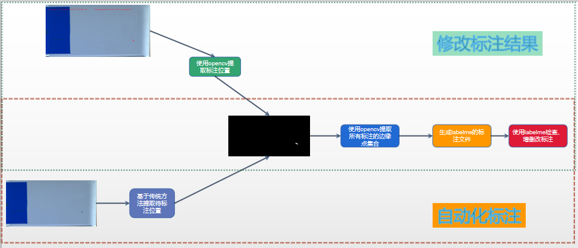

针对大规模，多前景的标注任务，本项目基于labelme工具加快标注速度，节省人力,可进行目标检测、图像分割的标注

# 系统环境

# 文档结构
```text
1.将标注结果转为labelme能解析的json格式 mask2json.py
2.labelme保存的json结构模板 labelme4.5.6_template.json
```

# 原理
```text
1.基于传统的图像处理方法或现有的数据获得前景的mask,在此基础上使用opencv的边缘查找算法，获得前景mask的边缘点集合
2.将前景mask的边缘点集合转为labelme能解析的json格式
3.使用labelme，检测、细化标注结果
```



# 使用
get_regoin.py 暂时未实现

## labelme->mask
```python
    labelmeannotation=LabelmeAnnotation(args.json_dir,args.out_dir)
    labelmeannotation.label_json_to_datasets()
```

## mask -> labelme
```python
mask2json=Mask2Json('./labelme4.5.6_template.json',is_reduce=True)
mask2json.mask_to_json(image_path,mask,save_json_dir=save_json_dir,mindis=6)
```


# 优势
```text
1.对图像中明显的物体具有较好的效果（可以自动化标注`部分`明细目标）
2.理论上边缘划分比人工划分更为准确
```

# 劣势
```text
1.标注的效果依赖于`传统算法的准确度`
2.对同意图像的不同的标注物体，可能需要不同的`传统算法`
```